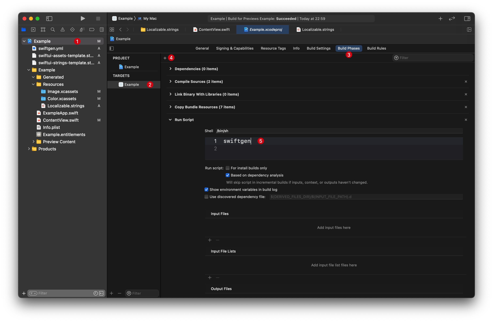

# SwiftGen 在 Swift5 + SwiftUI 下的配置方案
## 使用环境（条件）
* Swift 5
* SwiftUI
* 不使用 storyboard 和 xib
* 不勾选 Use Base Internationalization
* 本地化（默认英语）
  * 所有 .strings 文件需要在 file inspector 中点击 Localize 启用 Localization


## 已验证适配部分
- [x] String 资源
- [x] xcassets 图片资源
- [x] xcassets 颜色资源


## 安装
```
brew install swiftgen
```


## 配置
### 配置文件 
下载位置：[config files](https://github.com/wavky/SwiftGenConfigForSwiftUI/tree/master/config%20files)

将三个配置文件放置在项目根目录下：
* swiftgen.yml：SwiftGen 配置文件
* swiftui-assets-template.stencil：与 SwiftUI 适配的 xcassets 模板 
* swiftui-strings-template.stencil：与 SwiftUI 适配的 String 模板 

项目结构参考：
```
${PROJECT}
├── swiftgen.yml
├── swiftui-assets-template.stencil
├── swiftui-strings-template.stencil
└── ${PROJECT}
    ├── Generated
    ├── Resources
    │   ├── Color.xcassets
    │   ├── Image.xcassets
    │   ├── Localizable.strings  # 默认主 Strings 文件
    │   ├── OtherA.strings       # 可选追加附属 Strings 文件
    │   └── OtherB.strings
    ├── App.swift
    ├── ContentView.swift
    ├── Info.plist
    ├── InfoPlist.strings
    ├── ${PROJECT}.entitlements
    └── Preview Content
```

### 添加编译脚本
1. 点击导航栏的项目文件
2. 选择 TARGETS - Build Phases
3. 点击窗口左上角 + 按钮，选择 New Run Script Phase
4. 添加一句脚本
```
swiftgen
```


### 生成索引辅助类
1. ⌘B 执行项目编译
2. 左侧文件导航栏中右键：Add Files to …
3. 选择在 Generated 目录下生成的文件，添加到项目中即可（不要勾选复制）


## 在 SwiftUI 中使用
```swift
Image(Asset.Image.imageName.name) // 图片类资源
Text(L10n.textName.key) // 文本类资源
    .foregroundColor(
        Asset.Color.colorName.color // 颜色资源
    )

// 默认 Localizable.strings 会被编译为 L10n
L10n.textName      // 返回 Hashable 的 LocalizedString 类型
L10n.textName.key  // 返回 LocalizedStringKey 类型
L10n.textName.text // 返回 String 类型
L10n.textName.text(withLocale: locale)

// 其他的 .strings 文件会被编译到 L10nExtra
// 该类型名可在 swiftgen.yml 中配置
L10nExtra.fileName.textName
L10nExtra.fileName.textName.key
L10nExtra.fileName.textName.text
L10nExtra.fileName.textName.text(withLocale: locale)

Asset.Color.colorName.nsColor // 返回 NSColor 类型
Asset.Color.colorName.uiColor // 返回 UIColor 类型
```

## 区别说明
String 类型资源通过两个枚举类型返回索引：

* **L10n**：Localizable.strings 中的所有资源对应到该枚举类型
* **L10nExtra**：除此以外的所有 .strings 文件的所有资源对应到该枚举类型

(※ InfoPlist.strings 默认被排除在外)

### LocalizedString
上述两个枚举类型都通过一个遵循 Hashable 协议的包裹类型 LocalizedString，作为指向某个 String 资源的对象提供索引支持

LocalizedString 中包含两个字段和一个方法函数，通过两种返回类型对应不同使用场合（以 L10n 为例）：

```swift
// 返回 LocalizedString 本身，遵循 Hashable 协议，
// 可用于 ForEach 等要求 Hashable 的场合
L10n.textName

// 返回 LocalizedStringKey 类型
// 适用于 SwiftUI 的 Text 等部件
// 能从环境变量中感知 .locale 变化，自动・动态适配多语言
L10n.textName.key

// 返回 String 类型
// 默认返回 Locale.current 对应语言版本的资源
// 无法感知环境变量中的 .locale
L10n.textName.text

// 返回 String 类型
// 返回指定 Locale 对应语言版本的资源（识别其中的 identifier 字段）
// 无法感知环境变量中的 .locale
L10n.textName.text(withLocale: locale)

// 对于定义在 Localizable.strings 以外的 String 资源
// 在 SwiftUI 中使用其中的 LocalizedStringKey 对象时
// 需要同时传入 table 值（以定位资源所在文件名）
Text(L10nExtra.fileName.textName.key,
     tableName: L10nExtra.fileName.textName.table)
```

- - - -
## 其他
配置文件语法参考：
[SwiftGen/ConfigFile.md at stable · SwiftGen/SwiftGen · GitHub](https://github.com/SwiftGen/SwiftGen/blob/stable/Documentation/ConfigFile.md)

关于对 SwiftUI(LocalizedStringKey) 提供支持的讨论：
[SwiftUI use of LocalizedStringKey · Issue #685 · SwiftGen/SwiftGen · GitHub](https://github.com/SwiftGen/SwiftGen/issues/685)
